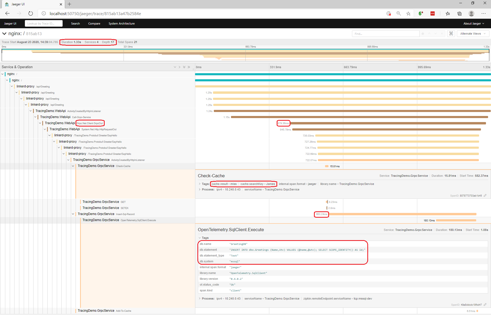

# Kelly's Distributed Tracing Demo
An oversimplified, but entirely repeatable, example of distributed tracing with [Linkerd](https://linkerd.io), [OpenTelemetry](https://github.com/open-telemetry/opentelemetry-dotnet) and [Jaeger](https://www.jaegertracing.io) in Kubernetes using ASP.Net Core, gRPC, Redis and SQL Server.

The purpose of this demo is to show you how to add distributed tracing into your .Net Core APIs and micro-services with the OpenTelemetry Beta for .Net and make it interact with the existing tracing capabilities and tooling in Linkerd 2.

This is not intended to be an in-depth discussion of the OpenTelemetry project, Linkerd or Kubernetes.  I've got just enough detail in the code and setup to give you a good idea of how to make it work for yourself. 

*Contributions welcome: If you have suggestions on how this example can be improved, I welcome any and all feedback.  This is a nights and weekends thing for me, so please don't be offended if I don't reply immediately.*

## Why do I need this?
* Do you do micro-services?
* Do you run in Kubernetes?  
* Do you write your code in .Net Core?  
* Does your code often run in environments you can't attach a debugger to?
* Does anything ever behave unexpectedly, in said environments?

They say a picture is worth a thousand words.  How about this one?  



Would you like to have this view when *service A* is not talking to *service B*, or when *service C* is taking so long your users are dying of old age?  We've all been there, this tooling and pattern is what keeps me sane and productive.

## Setup Instructions
Starting with a new (empty) Kubernetes cluster, will avoid unnecessary complications.

I ran my tests on [AKS](https://azure.microsoft.com/en-us/services/kubernetes-service/), but there is nothing really Azure specific.  This should work on any cloud or even bare-metal Kubernetes cluster. However, the `LoadBalancer` service for the ingress controller, and `PersistentVolumeClaim` for SQL Server, will require additional setup on bare-metal.

I'm executing all of these commands from the `setup` folder in this repository.

### 1) Install Linkerd 
I'm doing a textbook Linkerd 2 install with: 

```bash
$ linkerd install | kubectl apply -f -
```
Check out "https://linkerd.io/2/getting-started" for a detailed guide on Linkerd 2 setup.  

### 2) Install the Linkerd distributed-tracing add-on.
This consists of [OpenCensus Collector](https://opencensus.io/service/components/collector) and [Jaeger](https://www.jaegertracing.io).

```bash
$ linkerd upgrade --addon-config 02-linkerd-addon.yaml | kubectl apply -f -
```
See "https://linkerd.io/2/tasks/distributed-tracing" for more information.

### 3) Install [Nginx Ingress Controller](https://github.com/kubernetes/ingress-nginx).
There are many ways to skin this animal, I've included the YAML I used for my demo cluster.

*The Namespace definition in this YAML contains the same annotations as in step 6 (below).  If you don't use my YAML, you'll need to add these annotations to your `ingress-nginx` Namespace.  Also, the ConfigMap definition contains values for `enable-opentracing:`, `zipkin-collector-host:` and `zipkin-sample-rate:` that are required for this to work.*

```bash
$ kubectl apply -f 03-nginx-ingress.yaml
```

### 4) Get your external IP
Ask for the newly assigned external IP for the Ingress service and test it via HTTP, you should get a 404.

```bash
$ kubectl get svc -n ingress-nginx
```

### 5) Open Jaeger see your requests.
There are at least two ways to do this:  

My preferred method is to run the Linkerd dashboard, then browse to "http://localhost:50750/jaeger".   

```bash
$ linkerd dashboard
^ (CTRL+C when done)
```

The second option is to port-forward the service directly, then browse to "http://localhost:16686/". 

```bash
$ kubectl port-forward -n linkerd svc/linkerd-jaeger 16686
^ (CTRL+C when done)
```

### 6) Create the "demo" Namespace and switch into it.
This Namespace definition contains the annotations for Linkerd to automatically watch any new resources in the Namespace and inject the Linkerd proxy as well as participate in distributed tracing spans.

```bash
$ kubectl apply -f 06-demo-ns.yaml
$ kubectl config set-context --current --namespace=demo
```

Alternatively, you could add Linkerd annotations to your "default" Namespace.

```bash
$ kubectl annotate ns default \
    linkerd.io/inject=enabled \
    config.linkerd.io/trace-collector=linkerd-collector.linkerd:55678 \
    config.alpha.linkerd.io/trace-collector-service-account=linkerd-collector
```  

### 7) Install SQL Server 2017.
I will never hard-code an "sa" password, so this requires 2 commands.

```bash
$ kubectl create secret generic mssql --from-literal=SA_PASSWORD=<your-sa-password>
$ kubectl apply -f 07-mssql.yaml
```

### 8) Create the database with "[mssql-cli](https://docs.microsoft.com/en-us/sql/tools/mssql-cli?view=sql-server-ver15)".
My command below uses local port 14330 (in case you have SQL Server installed locally). You will have to wait for the `mssql-dev-0` pod to fully start before you can complete this step.  It may take a minute to provision the persistent volume.

*This requires two shell prompts, one for the port-forward, and one for mssql-cli.  You could also port-forward in one shell prompt and run the script in any SQL GUI tool.*

```bash
$ kubectl port-forward pod/mssql-dev-0 14330:1433
^ (CTRL+C when done)
```

```bash
$ mssql-cli -S 127.0.0.1,14330 -U sa -P <your-sa-password> -i 08-create-db.sql
```

### 9) Install Redis.
This one is easy, as I'm only using Redis as a ephemeral cache and not persisting anything to disk. 

```bash
$ kubectl apply -f 09-redis.yaml
```

### 10) Install my sample apps.
This is one large script to reduce the number of steps. 

```bash
$ kubectl apply -f 10-sample-apps.yaml
```

### 11) Setup the Ingress route
This will allow you to access your WebApi from outside the cluster.  This also causes Nginx to initiate the traces that we will propagate.

*My example Ingress route is for http://greeter.demo which requires you to modify your hosts file to point this hostname to the external IP you discovered in step 4 (above).  Another option would be to point an actual DNS address at your IP and modify the "host" line in the Ingress definition*

```bash
$ kubectl apply -f 11-ingress.yaml
```

### 12) You're good to go.
Give the sample apps a minute to start up, then browse to "http://greeter.demo/". You should get Swagger docs to implement a client or you can just play with the API right through the browser.

Repeating the process from Step 5 will let you see your traces.

## Peeking at your data

You can look in your SQL Database at any time with the following commands.  This requires port-forwarding and therefor two command prompts.

```bash
$ kubectl port-forward pod/mssql-dev-0 14330:1433
^ (CTRL+C when done)
```

```bash
$ mssql-cli -S 127.0.0.1,14330 -U sa -P <your-sa-password> -d GreetingDb -Q "SELECT * FROM dbo.Greetings"
```

## How do I make this work in my code?
I know what you're thinking.  This example is intended for developers, but most of what you've read to this point has been; infrastructure, configuration and deployment.  We all love DevOps these days, don't we?!?

The good news is that adding OpenTelemetry to your code is simple and probably takes less time than the scratch   Kubernetes configuration does.

*NOTE: My code uses [Serilog](https://serilog.net/) to enhance the default ASP.Net Core logging.  This is not required, I just like it better.  I especially love it when combined with [Seq](https://datalust.co/seq) by [Datalust](https://datalust.co/), which I can't recommend highly enough, and pairs beautifully with distributed tracing.  That's outside the scope of this example though.*

### 1) Install Packages
You need to install some OpenTelemetry NuGet packages into your project(s). The simplest way to see the packages needed is to look in my two sample service projects.

**[webapi.csproj](src/webapi/webapi.csproj)**

This is my WebApi that calls the gRPC service.

**[grpc.csproj](src/grpc/grpc.csproj)**

This is my gRPC service that also talks to Redis and SQL Server:

### 2) Add some bits to your Startup.cs
Again, the simple solution is to look in the samples. 

**[webapi/Startup.cs](src/webapi/Startup.cs)**

**[grpc/Startup.cs](src/grpc/Startup.cs)**

The important bits to pay attention to are:

```csharp
// create and register an activity source
var activitySource = new ActivitySource(Program.Name);
services.AddSingleton(activitySource);

// Configure OpenTelemetry
services.AddOpenTelemetry(builder =>
{
	// register the activity source
	builder.AddActivitySource(activitySource.Name);
...
```
This sets up the OpenTelemetry framework and registers an `ActivitySource`.  The Activity Source is the key to having control of your internal tracing detail. The framework will largely take care of RPC tracing once configured properly.

Don't worry about `Program.Name`, that was a convenient place for me to put a constant that I'll use a few times. 

```csharp
// TextFormat Defaults to W3C - Enable B3 via configuration
string tracingFormat = Configuration["Tracing:Format"]?.ToLowerInvariant();

// Add ASP.Net Core Request Handling
builder.AddAspNetCoreInstrumentation(options =>
{
    if (tracingFormat == "b3m") // B3 (multi) headers come from Nginx
        options.TextFormat = new B3Format(singleHeader: false);
    else if (tracingFormat == "b3s")
        options.TextFormat = new B3Format(singleHeader: true);
});

```
This adds the automatic handling of incoming ASP.Net Core Requests (MVC, WebApi & gRPC) and will accept inbound trace headers.

The bit about `tracingFormat` that sets `options.TextFormat` is how we configure OpenTelemetry.Net to use B3*m* headers instead of the default W3C headers.  This is required to work with Nginx and Linkerd.

```csharp
// Add HttpClient & gRPC Propagation (order matters for gRPC to support B3 format)
builder.AddHttpClientInstrumentation(options =>
{
    if (tracingFormat == "b3m") // Send B3 headers downstream (for Linkerd)
        options.TextFormat = new B3Format(singleHeader: false);
    else if (tracingFormat == "b3s")
        options.TextFormat = new B3Format(singleHeader: true);
})
.AddGrpcClientInstrumentation();
```

This is only in the WebApi and tells the framework to propagate child spans via HTTP Headers on outbound requests with HttpClient and GrpcClient.  The order matters here.  We have to tell HttpClient (used internally by GrpcClient) to use B3*m* headers.  We do this just like we did with ASP.Net request handling (above).  We need it to send out B3*m* headers instead of W3C headers to be seen by the Linkerd Proxy.

```csharp
// add automatic instrumentation for Sql Server
builder.AddSqlClientDependencyInstrumentation(options =>
{
    options.SetTextCommandContent = true;   // probably not in production?
    options.EnableConnectionLevelAttributes = true;
});

// add automatic instrumentation for Redis (needs ConnectionMultiplexer)
builder.AddRedisInstrumentation(redisProtoCache.Connection);
```
These bits are only in the gRPC service, since only it talks to Redis and SQL Server.  This is pretty self-explanatory.  These providers allow capture and tracing inside calls to Sql and Redis.

```csharp
// export to Zipkin receiver
string zipkinUrl = Configuration.GetConnectionString("Telemetry");
if (!string.IsNullOrEmpty(zipkinUrl))
{
    builder.UseZipkinExporter(options =>
    {
        options.ServiceName = Program.Name;
        options.Endpoint = new Uri(zipkinUrl);
    });
}

// enable console output by configuration
if (Configuration.GetValue<bool>("Tracing:Console", false))
    builder.UseConsoleExporter();
```
Finally, this is in both services.  This is how we configure OpenTelemetry to write the spans out to the Zipkin receiver and optionally, the console.  The [appsettings.json](src/webapi/appsettings.json) files in both service projects have the default Telemetry connection string you'll use with Linkerd.

### 3) Use Activities in your Controllers and Services

The `ActivitySource` and `Activity` classes are the key to internal tracing spans and adding data.  To start using them, add the `ActivitySource` via DI.  This works in Controllers and GrpcServices.

```csharp
public class GreetingController : ControllerBase
{
    private readonly ILogger<GreetingController> _logger;
    private readonly Greeter.GreeterClient _greeterClient;
    private readonly ActivitySource _activitySource;

    public GreetingController(ActivitySource activitySource, Greeter.GreeterClient greeterClient, ILogger<GreetingController> logger)
    {
        _activitySource = activitySource;
        _greeterClient = greeterClient;
        _logger = logger;
    }
...
```

Of course I'm going to point you to the actual code again for more info. 

**[webapi/Controllers/GreetingController.cs](src/webapi/Controllers/GreetingController.cs)**

**[grpc/Services/GreeterService.cs](src/grpc/Services/GreeterService.cs)**

Here are a few snippets that are interesting from *GreeterService.cs* and deserve a bit of explanation.

```csharp
if (context.Status.StatusCode != StatusCode.OK)
{
    // record validation failure as trace event
    Activity.Current?.AddEvent(new ActivityEvent(context.Status.ToString()));    
...
```
The snippet above adds an `ActivityEvent` to the current `Activity` to include details of input validation failure in the trace.

```csharp
// try to get our reply from the cache
using (Activity tryCacheActivity = _activitySource.StartActivity("Check-Cache"))
{
    tryCacheActivity?.AddTag("cache.searchKey", request.Name);
    HelloReply cacheHit = await _cache.GetProto<HelloReply>(request.Name);
    if (cacheHit != null)
    {
        tryCacheActivity?.AddTag("cache.result", "hit");
        return cacheHit;
    }
    
    tryCacheActivity?.AddTag("cache.result", "miss");
}
```
This snippet creates a new "Check-Cache" activity before going out to Redis and tags on the hit/miss result, as well as the key searched, to the trace.  You saw this pointed out in the screenshot above.

```csharp
using (Activity insertActivity = _activitySource.StartActivity("Insert-Sql-Record"))
{
    int recId = await _repository.InsertGreeting(record, context.CancellationToken);
    insertActivity?.AddTag("record.id", recId.ToString());

    _logger.LogInformation("Inserted new greeting record {@record}", record);
}
```

This `Activity` tracks the round-trip to the database and includes the new record Identity in the trace info.  This can be a sanity saver when you need to look for a data inconsistency caused by a service error. 

## Show me the headers
If you want to see the actual B3 headers that make this all work, check out the included "[setup/extras/echoheaders.yaml](setup/extras/echoheaders.yaml)". 

```bash
$ kubectl apply -f extras/echoheaders.yaml
```

The included ingress rule maps "echo.greeter.demo", so you'll need to add that to your hosts file also.  Give it the same IP as you have from setup step 4.  If you open a browser to "http://echo.greeter.demo/" you'll see something like the following.

```text
...
Request Headers:
	accept=text/html,application/xhtml+xml,application/xml;q=0.9,image/webp,image/apng,*/*;q=0.8,application/signed-exchange;v=b3;q=0.9
	accept-encoding=gzip, deflate
	accept-language=en-US,en;q=0.9
	cache-control=max-age=0
	host=echo.greeter.demo
	l5d-dst-canonical=echoheaders.demo.svc.cluster.local:80
	upgrade-insecure-requests=1
	user-agent=Mozilla/5.0 (Windows NT 10.0; Win64; x64) AppleWebKit/537.36 (KHTML, like Gecko) Chrome/84.0.4147.135 Safari/537.36
	x-b3-flags=0
	x-b3-parentspanid=529cef1c2e371ecf
	x-b3-sampled=1
	x-b3-spanid=3551dac81b7ba8d4
	x-b3-traceid=178f408e6509b549
	x-forwarded-for=127.0.0.1
	x-forwarded-host=echo.greeter.demo
	x-forwarded-port=80
	x-forwarded-proto=http
	x-real-ip=127.0.0.1
	x-request-id=c739708686ab84579ba692d33ae5231e
	x-scheme=http
...
```

These are all the HTTP headers that Nginx sent to your Pod, simply echoed back to you.  The ones that start with `x-b3-*` are the relevant headers for tracing.  See [openzipkin/b3-propagation](https://github.com/openzipkin/b3-propagation) on GitHub for a lot more detail.

## Wrapping up
There are a few ways to get this kind of capability, and many different tools and techniques. This is simply my recipe.  

I hope you enjoy!
